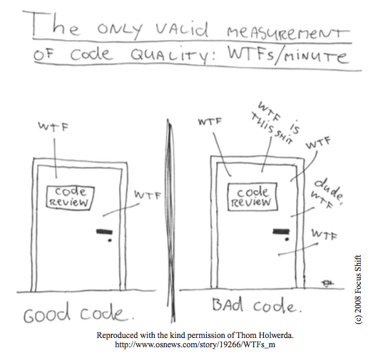
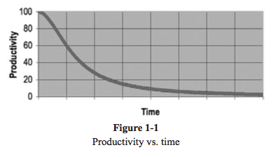

_This is a transcript from [a presentation](http://nathanbirrell.me/clean-javascript) I gave on [Clean Code](https://www.amazon.com.au/Clean-Code-Robert-C-Martin/dp/0132350882), applied to Javascript applications._

This post is inspired by Martin Cronjé's talk at LASTConf 2016 called "Establishing craftsmanship culture in a team." The premise was that we have an education problem in software engineering: learning is unstructured, ad-hoc and programming is not treated as a "craft" in most organisations.

Martin gave a few ideas on how to improve this, namely regular pair programming, deliberate practice (code retreats, coder dojos, etc.) and of course reading and sharing – which is what I'm doing here. These are my notes on chapters 1–4 of Robert C Martin's _Clean Code_, applied to Javascript.

## Clean Code

**Clean code:** code that is maintainable, readable, simple and tested. Developers always face this eternal balancing act, that is, we know mess slows us down, yet we feel pressure to make messes in order to meet deadlines. In other words: we don't make time to go fast.

<!-- <small>Code quality: number of WTFs per minute</small> -->

Every programmer has been slowed down by someone else's – or, more likely, their own – messy code.

### The total cost of owning a mess

"Fast teams" in the beginning become slow with complex, tangled and fragile codebases. All due to unforeseen consequences of scope changes, tight schedules, poor code readability, onboarding becomes a nightmare, the list goes on...

### The boy scout rule

It's a programmer's job to defend the code, in the same way a manager defends their schedule and requirements. An easy way to start this is the boy scout rule:

> Leave the campground cleaner than you found it.

## Meaningful names

Names of variables, functions and classes should:

* be meaningful
* be intention-revealing
* be pronounceable
* avoid disinformation (for example: accidental similarities, subtle name differences, puns)

In general:

* use longer names for things with larger scope, it helps with searchability
* use nouns for classes/objects, verbs for functions/methods
* be consistent when naming around similar concepts (for example: 'handle' prefix before component event-handler methods in `handleSubmit`)
* don't hesistate to change poor names globally. People are often afraid of renaming things for fear of objections, but we should be grateful when names change for the better.

Good naming requires good descriptive skills and a shared cultural background in a team. It's certainly not a _technical_ issue as much as it is a teaching one.

## Functions

A few useful guides on writing functions.

### Make them smaller

The first rule of functions is that they ought to be **small**. The second rule: even smaller. Functions can never be too small.

Whilst this certainly makes a lot of sense in Java Land (this book is primarily based on Java examples), it holds true irrespective of your chosen technology.

### One-line blocks

While I consider this one a bit extreme, it's certainly a useful experiment: **Keep blocks inside `if`, `else`, and loops to one line.** The idea here being that it keeps your block tidy and provides documentary value, thanks to the descriptive naming.

Practically, this one is hard to achieve, but more often than not you can break chunks of your block-level logic down.

### Do one thing

Functions that do one thing read better, are far easier to test and are usually more predictable. [Pure functions](https://en.wikipedia.org/wiki/Pure_function) come into play here for Javascript developers, avoiding side effects where you can is almost always a good idea.

### Abstraction

In general, it's best to keep to one level of abstraction per function. From a reader's perspective, this helps discern whether parts of expressions are essential concepts or details.

### Read top-to-bottom

Functions should read like a narrative, in a logical top-to-bottom order.

### Switch statements

Tricky to do _one_ thing, by nature switch statements do `n` things. Bury these in deeper/low-level functions.

### Don't repeat yourself (DRY)

Everyone should know [this](https://en.wikipedia.org/wiki/Don%27t_repeat_yourself) one.

<!-- TODO: add notes on side effects, arguments and exceptions > error codes -->

## Comments

At best, comments are a necessary evil.

Why?

* comments often lie because programmers can't realistically maintain them
* comments don't make up for bad code
* clear/expressive code with few comments is always better than complex code with lots of comments

Some legitimate use cases for comments:

* legal comments, licensing and the like
* explanation of intent
* clarification of obsure code or workarounds
* warning of consequences
* `TODO`s

In general, if you feel you need to comment, try improving/adding a function or variable name instead.

## Write code for humans, not computers

Hopefully these notes give you some ideas for your daily practice. The eternal tradeoff between short-term loss and long-term benefits will remain persistent, but remember: write code for humans, not computers.

As this is only the first four chapters, to read on about formatting, objects and data structures, error handling, boundaries, unit tests and concurrency, go on to read [Clean Code](https://www.amazon.com.au/Clean-Code-Robert-C-Martin/dp/0132350882) yourself.

<small>👏🏼 Thanks to [Taylor Bett](http://taylorbett.github.io/) for proof reading this transcript</small>